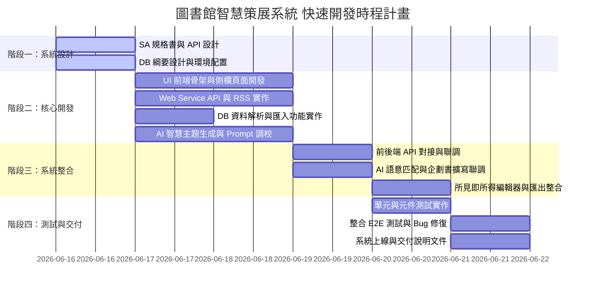

# 圖書館智慧策展系統 - 專案任務分工表

本專案團隊由 6 位成員組成，分別擔任 **SA (系統分析)**、**UI (介面開發)**、**Web Service (後端開發)**、**DB (資料庫實作)**、**AI (智慧功能開發)** 與 **Testing (專案測試)**。以下為本專案的任務分工與協作規劃。

---

## 團隊成員與核心職責總覽

| 角色 | 核心工作內容 | 主要交付物 | 協作對象 |
| :--- | :--- | :--- | :--- |
| **SA (系統分析)** *(專案負責人)* | 系統規格制定、API 、時程與分工協調 | `系統規格書.md` `任務分工表.md` API 規格定義表 | 所有成員 |
| **UI (使用者介面)** | 前端介面設計與開發、富文本編輯器整合、戰情室圖表渲染 | React 前端原始碼 戰情室儀表板介面 所見即所得編輯頁面 | SA, Web Service |
| **Web Service (後端)** | 後端 API 實作、外部 RSS 關鍵字串接、檔案匯出模組實作 | FastAPI 後端原始碼 RSS 爬取模組 Word/PDF 匯出模組 | SA, UI, DB, AI |
| **DB (資料庫)** | PostgreSQL 資料庫安裝設定、Schema 遷移、館藏檔案解析與批次匯入 | SQL 綱要與 Migration 腳本 Excel/CSV 解析與匯入函數 戰情室統計 SQL 查詢 | SA, Web Service |
| **AI (智慧功能)** | Gemini/OpenRouter API 串接、Prompt 模板設計、AI 館藏語意比對 | AI 服務模組 (`ai_service.py`) 策展主題/企劃書 Prompt 模板 | SA, Web Service |
| **Testing (專案測試)** | 後端 API 單元測試、前端元件測試、端到端 (E2E) 流程測試 | `pytest` 測試腳本 `jest` 測試腳本 測試報告與 Bug 清單 | 所有成員 |

---

## 專案開發階段與時程規劃

本專案預計分為四個階段進行：

---

## 開發相依性與優先序說明 (Development Dependencies)

由於資料庫架構升級為 **PostgreSQL + pgvector** 向量語意檢索，各角色的開發順序與相依性調整如下，請團隊成員務必遵守配合：

1. **🚨 AI 優先交付 Embedding 接口 (相依性最高)**：
   - **AI 開發人員** 必須在 **6/17 (第2天) 中午前** 優先交付 `get_text_embedding()` 向量轉換函數。
   - **DB** 與 **Web Service** 取得此函數後，才能在當天下午順利實作館藏匯入的向量化寫入邏輯。
2. **🐳 資料庫 pgvector 本機環境標準化**：
   - **DB 開發人員** 需在 **6/16 (第1天)** 提供內建 pgvector 的 PostgreSQL Docker Compose 設定檔或啟動腳本。
   - 確保所有開發人員（Web Service、Testing、AI）能一鍵建立本機向量資料庫環境。
3. **🔑 後端環境變數 `.env` 配置**：
   - 所有後端與 AI 開發者本機必須配置 `GEMINI_API_KEY`。現在除了 AI 功能，後端測試圖書匯入 API 也會調用 Embedding API。
4. **🧪 測試 Mock 優先實作**：
   - **Testing 人員** 需在 **6/18 前** 完成 Embedding API 的 Mock 測試機制，確保本地 CI 測試不因網路或 API 金鑰缺失而中斷。

---

## 各角色任務清單 (Task Checklist)

### 1. SA (系統分析 - 專案協調者)
- [x] **A-1：系統分析與設計文件撰寫**
  - 完成 `系統規格書.md` 的制定。
  - 設計系統流程圖、API 詳細 Request/Response 欄位。
- [x] **A-2：協作介面標準化**
  - 定義統一的資料交換格式（JSON）與狀態代碼。
  - 主導並召開前後端、AI、DB 的規格對接會議。
- [x] **A-3：進度追蹤與整合驗證**
  - 每週追蹤各分工交付物進度。
  - 協同 Testing 角色進行系統整合驗證。

### 2. UI (前端開發)
- [ ] **B-1：前端基礎框架建置**
  - 初始化 React + Vite + TailwindCSS + Ant Design 專案結構。
  - 完成側欄 (Sidebar) 與主框架布局設計。
- [ ] **B-2：AI 智慧策展發想介面開發**
  - 開發關鍵字/時事/節慶參數設定表單。
  - 實作 AI 生成主題的大綱卡片渲染、自訂 Prompt 輸入框、載入中 (Loading) 骨架屏。
- [ ] **B-3：策展企劃管理中心開發**
  - 整合線上富文本編輯器 (TinyMCE 或 Quill)，支援文字加粗、段落調整等功能。
  - 實作「拋轉企劃書」與「下載 Word/PDF」操作按鈕。
- [ ] **B-4：效益分析戰情室開發**
  - 使用 Chart.js / Recharts 實作視覺化圖表，呈現累計節省工時與經費。
  - 實作參數設定 Modal，供管理者調整時薪與人工基準時數。
- [ ] **B-5：館藏資料匯入介面**
  - 實作拖曳上傳 Excel/CSV 檔案的介面。

### 3. Web Service (後端開發)
- [x] **C-1：FastAPI 後端框架搭建**
  - 建置 FastAPI 專案架構，整合 CORS、異常處理機制。
  - 設計 `/curation_management/backend/generate_themes` 等 API 路由。
- [x] **C-2：時事熱門話題抓取**
  - 撰寫 `rss_service.py`，串接並解析 Google Trends RSS 及熱門新聞 RSS。
- [/] **C-3：館藏導入 API 路由**
  - 實作上傳檔案端點，將檔案接收後協同 AI 生成向量，再拋轉給 DB 進行批次寫入。
- [x] **C-4：企劃書編輯與匯出端點**
  - 實作 Word (`python-docx`) 與 PDF (`reportlab` 或 `xhtml2pdf`) 的匯出端點，支援線上 HTML 格式轉檔。
- [x] **C-5：身分驗證與權限控制**
  - 實作 JWT Token 生成與單一登入 (SSO) 模擬驗證。

### 4. DB (資料庫實作)
- [ ] **D-1：資料庫配置與 Schema 遷移**
  - 安裝設定 PostgreSQL，並安裝 `pgvector` 擴充套件，以 Alembic 初始化資料庫遷移。
  - 建立 `users`、`catalog_books`（含 `embedding` 向量欄位與 HNSW 索引）、`curation_themes`、`proposals`、`cost_benefit_logs` 等資料表。
- [ ] **D-2：館藏 Excel/CSV 檔案解析與批次寫入**
  - 撰寫 Python 解析 Excel/CSV 內容的邏輯。
  - 實作批次寫入資料庫函數，支援將生成之 768 維向量資料快速存入 PostgreSQL（使用 SQLAlchemy bulk_insert 或 PostgreSQL 原生 COPY）。
- [ ] **D-3：索引優化與效能調校**
  - 針對 `catalog_books` 的 `isbn`、`classification_no` 與 HNSW 向量欄位建立索引，以加速比對。
- [ ] **D-4：戰情室數據聚合查詢**
  - 撰寫高效能 SQL Aggregation 查詢，依月、季、年統計累計節省的工時與經費。

### 5. AI (AI功能開發)
- [x] **E-1：Gemini / OpenRouter API 串接**
  - 整合 SDK，設計與實作 `ai_service.py` 連線管理與錯誤重試機制。
- [x] **E-2：Prompt 模板設計與調校**
  - 設計「主題大綱生成」與「企劃草案擴寫」的系統 Prompt，限制輸出格式必須為穩定的 JSON 結構。
- [x] **E-3：Gemini Embedding 串接與語意匹配**
  - 實作 `text-embedding-004` 模型對接，將書目資訊及發想關鍵字/主題轉化為 768 維度向量。
  - 實作基於 pgvector 餘弦距離的相似度搜尋演算法，進行圖書館藏書目與策展主題的自動語意匹配。

### 6. Testing (專案測試)
- [ ] **F-1：後端單元與整合測試 (PyTest)**
  - 撰寫 API 欄位驗證測試、LLM 異常回應時的降級測試、Excel/CSV 損毀時的錯誤處理測試。
- [ ] **F-2：前端單元與元件測試 (Jest)**
  - 驗證各 UI 元件在不同 State (如 `isLoading = true`) 下的渲染表現。
- [ ] **F-3：端到端系統整合測試 (E2E Test)**
  - 實作 Cypress 或 Playwright 腳本，完整跑通：
    `SSO 登入 -> 匯入圖書 -> 點擊時事發想 -> 選擇主題 -> 匹配館藏 -> 拋轉企劃書 -> 線上編輯 -> 匯出 PDF -> 檢查戰情室數據`。

---

## 專案交付與整合檢查清單 (Definition of Done)

在每個階段或功能宣稱完成前，必須符合以下條件：
1. **程式碼規範**：所有程式碼必須通過 Lint 檢查 (例如 ESLint, Flake8)，且無嚴重安全性漏洞。
2. **測試覆蓋率**：核心業務邏輯 (如資料匯入、AI Prompt 呼叫、戰情室計算) 的單元測試覆蓋率需達到 **80% 以上**。
3. **API 規格一致**：所有實作之 API 的 Request/Response 欄位必須與 `系統規格書.md` 記載之規格完全相符。
4. **版本控制**：所有變更須經由 PR (Pull Request) 並由至少一位小組成員審查 (Code Review) 通過後方可合併至 `main` 分支。
